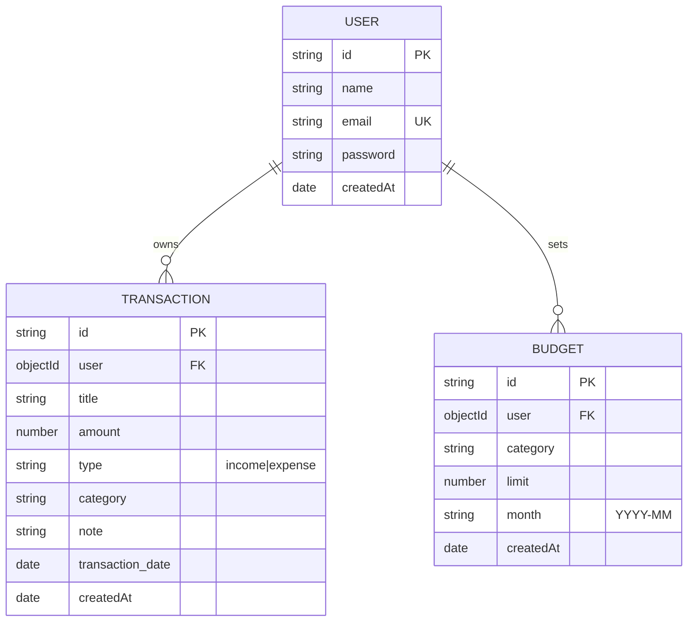

# FinTrack Database Documentation

FinTrack uses **MongoDB** as its primary database, with **Mongoose** as the Object Data Modeling (ODM) library. The database is designed with a user-centric structure where every transaction and budget is associated with a specific user.

## Collection Overview

The database contains three main collections:
1. `users`: Stores account information and credentials.
2. `transactions`: Stores income and expense records.
3. `budgets`: Stores monthly spending limits per category.

## Visual Schema (ER Diagram)

---

## 1. User Collection (`users`)

Stores information for registered users.

| Field | Type | Required | Unique | Description |
| :--- | :--- | :--- | :--- | :--- |
| `name` | String | Yes | No | Full name of the user. |
| `email` | String | Yes | Yes | Login email (used for identification). |
| `password` | String | Yes | No | Hashed password. |
| `createdAt` | Date | (Auto) | No | Timestamp when the account was created. |
| `updatedAt` | Date | (Auto) | No | Timestamp when the account was last updated. |

---

## 2. Transaction Collection (`transactions`)

Stores all financial entries (Income & Expense).

| Field | Type | Required | Description |
| :--- | :--- | :--- | :--- |
| `user` | ObjectId | Yes | Reference to the `User` who owns this transaction. |
| `title` | String | Yes | Short description of the transaction (e.g., "Grocery Store"). |
| `amount` | Number | Yes | Numeric value of the transaction. |
| `type` | String | Yes | Must be either `'income'` or `'expense'`. |
| `category` | String | No | Category name (e.g., "Food", "Salary"). |
| `note` | String | No | Optional detailed notes (default: `""`). |
| `transaction_date` | Date | No | Date of the transaction (default: `now`). |
| `createdAt` | Date | (Auto) | Record creation timestamp. |

---

## 3. Budget Collection (`budgets`)

Stores monthly spending targets for specific categories.

| Field | Type | Required | Description |
| :--- | :--- | :--- | :--- |
| `user` | ObjectId | Yes | Reference to the `User` who owns this budget. |
| `category` | String | Yes | Category name the budget applies to. |
| `limit` | Number | Yes | Maximum allowed spending for this category. |
| `month` | String | Yes | Format: `YYYY-MM` (e.g., `"2026-05"`). |
| `createdAt` | Date | (Auto) | Record creation timestamp. |

### Indexes & Constraints:
- **Compound Unique Index**: `{ user: 1, category: 1, month: 1 }`
  - *Ensures a user cannot create duplicate budgets for the same category in the same month.*

---

## Data Relationships

- **One-to-Many**: A `User` can have many `Transactions`.
- **One-to-Many**: A `User` can have many `Budgets`.
- Both `Transactions` and `Budgets` use a `user` field containing the `ObjectId` of the owner to enforce data isolation (users only see their own data).

## Common Queries

- **Total Balance**: Sum of `amount` where `type: income` minus sum of `amount` where `type: expense` for a specific `user`.
- **Budget Tracking**: Calculate the sum of `transactions` where `category` matches `budget.category` and `transaction_date` is within `budget.month`.
